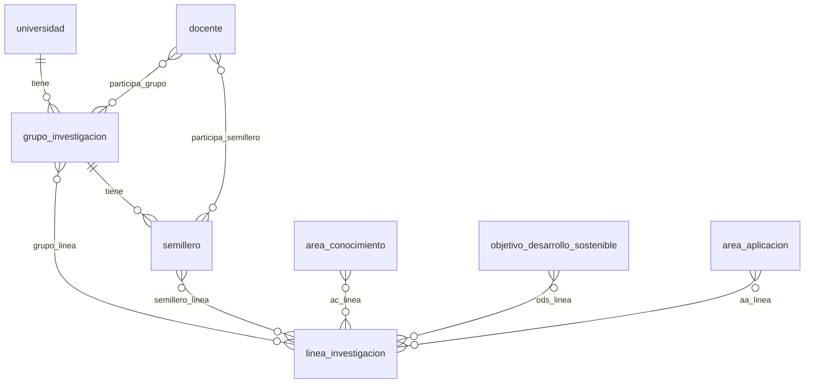

# Cambios en el modelo de datos — v2

> **Estado:** borrador. Los `[NECESITA ACLARACIÓN]` se resuelven con el SQL
> oficial antes de programar.

La v2 **no crea tablas nuevas**: las 19 tablas del módulo ya existen desde el
primer arranque. Lo que cambia es:

1. Una columna nueva en `universidad` (para el disparador).
2. El campo `activo` donde todavía no exista.
3. Los procedimientos almacenados y los triggers.

## 1. Columna para el disparador (propuesta A)

Para cumplir el criterio de tener **al menos un disparador funcionando**,
`universidad` (maestro) guarda cuántos grupos de investigación activos tiene
(detalle).

| Dato | Valor |
|---|---|
| Tabla modificada | `universidad` |
| Columna agregada | `total_grupos INT NOT NULL DEFAULT 0` |
| Tabla que la alimenta | `grupo_investigacion` |
| Quién la calcula | Un procedimiento llamado por 3 triggers |

**Justificación:** evita un `COUNT()` en cada consulta y deja un ejemplo claro
de lo que hace un disparador: el dato cambia solo, sin que la API lo envíe.

```sql
ALTER TABLE universidad
    ADD COLUMN IF NOT EXISTS total_grupos INT NOT NULL DEFAULT 0;
```

`ADD COLUMN IF NOT EXISTS` permite correr el script varias veces sin error.

Después de crear la columna hay que **calcular el valor inicial**, porque las
universidades que ya tienen grupos arrancarían con `0`:

```sql
UPDATE universidad u
SET total_grupos = (SELECT COUNT(*) FROM grupo_investigacion g
                    WHERE g.universidad_id = u.id AND g.activo = 1);
```

`[NECESITA ACLARACIÓN: nombre real de la FK en grupo_investigacion (aquí universidad_id).]`

### Reglas de `total_grupos`

- Es **solo de lectura** para el cliente. Igual que `activo`, no se envía en
  `POST`, `PUT` ni `PATCH`.
- `sp_crear_universidad` y `sp_actualizar_universidad` **no reciben** este
  campo.
- Solo lo modifica el procedimiento de recuento.
- Aparece en la respuesta de `universidad` como dato informativo.

## 2. Triggers

En MariaDB un trigger atiende **un solo evento**, así que son tres, sobre
`grupo_investigacion`, y los tres llaman al mismo procedimiento.

| Trigger | Evento | Qué recuenta |
|---|---|---|
| `trg_grupo_ai` | `AFTER INSERT` | La universidad del grupo nuevo |
| `trg_grupo_au` | `AFTER UPDATE` | La universidad nueva y la anterior |
| `trg_grupo_ad` | `AFTER DELETE` | La universidad del grupo borrado |

```sql
DELIMITER $$

CREATE OR REPLACE PROCEDURE sp_recontar_grupos(IN p_universidad INT)
BEGIN
    UPDATE universidad
    SET total_grupos = (SELECT COUNT(*) FROM grupo_investigacion
                        WHERE universidad_id = p_universidad AND activo = 1)
    WHERE id = p_universidad;
END$$

CREATE OR REPLACE TRIGGER trg_grupo_ai
AFTER INSERT ON grupo_investigacion
FOR EACH ROW
    CALL sp_recontar_grupos(NEW.universidad_id)$$

CREATE OR REPLACE TRIGGER trg_grupo_au
AFTER UPDATE ON grupo_investigacion
FOR EACH ROW
BEGIN
    CALL sp_recontar_grupos(NEW.universidad_id);
    IF OLD.universidad_id <> NEW.universidad_id THEN
        CALL sp_recontar_grupos(OLD.universidad_id);
    END IF;
END$$

CREATE OR REPLACE TRIGGER trg_grupo_ad
AFTER DELETE ON grupo_investigacion
FOR EACH ROW
    CALL sp_recontar_grupos(OLD.universidad_id)$$

DELIMITER ;
```

Puntos importantes:

- El trigger de `UPDATE` es **imprescindible**: con borrado lógico, retirar un
  grupo es un `UPDATE`.
- El trigger está en `grupo_investigacion` y modifica `universidad`. Si
  modificara su propia tabla fallaría (error 1442).
- Se comprueba **desde la pantalla**: crear o retirar un grupo cambia el
  contador de su universidad sin que la API lo envíe.

## 3. El campo `activo` en las tablas de la v2

`activo TINYINT(1) NOT NULL DEFAULT 1` es el mismo campo de la v1.

| Tipo de tabla | Qué se hace |
|---|---|
| Maestras (`docente`, `grupo_investigacion`, `semillero`) | Si no tiene `activo`, se agrega con `ALTER` |
| Puente | `[NECESITA ACLARACIÓN: ¿llevan activo o se borran físicamente?]` |

```sql
ALTER TABLE docente
    ADD COLUMN IF NOT EXISTS activo TINYINT(1) NOT NULL DEFAULT 1;
```

Se repite para cada tabla que lo necesite.

Reglas (iguales a la v1):

- El cliente **no envía** `activo`.
- Listados, consultas y desplegables filtran `activo = 1`.
- `sp_eliminar_*` cambia `activo` a `0`; nunca borra la fila.

> [!NOTE]
> Si el SQL oficial ya trae `activo`, no hace falta el `ALTER`. Hay que
> confirmarlo antes de escribir el script.

## 4. Procedimientos almacenados

Toda operación de las 10 tablas pasa por un procedimiento con el nombre
`sp_<acción>_<tabla>`:

| Operación | Procedimiento | Qué hace |
|---|---|---|
| Listar | `sp_listar_<tabla>` | `SELECT` con `activo = 1` |
| Ver uno | `sp_consultar_<tabla>` | `SELECT` por llave con `activo = 1` |
| Crear | `sp_crear_<tabla>` | `INSERT` y devuelve la fila guardada |
| Actualizar | `sp_actualizar_<tabla>` | `UPDATE` de los campos editables |
| Retirar | `sp_eliminar_<tabla>` | `UPDATE ... SET activo = 0` |

Reglas:

- Se escriben con `DELIMITER $$` y `CREATE OR REPLACE PROCEDURE`.
- `sp_crear_*` devuelve la fila con un `SELECT` final (MariaDB no tiene
  `RETURNING`). Si la llave es `AUTO_INCREMENT`, guarda `LAST_INSERT_ID()` en
  una variable antes de otra sentencia.
- `PUT` y `PATCH` usan el mismo `sp_actualizar_*`: el servicio lee el
  registro actual, mezcla los datos enviados y llama con todos los campos.
- `sp_eliminar_*` de un **maestro** revisa si tiene hijos activos y, si los
  tiene, lanza `SIGNAL SQLSTATE '45000'`.
- Los procedimientos de las **tablas puente** son `sp_listar_`, `sp_crear_` y
  `sp_eliminar_`. No llevan `sp_actualizar_`, porque una pareja no se edita.

Ejemplo (`semillero` de un grupo):

```sql
DELIMITER $$

CREATE OR REPLACE PROCEDURE sp_eliminar_grupo_investigacion(IN p_id INT)
BEGIN
    IF EXISTS (SELECT 1 FROM semillero
               WHERE grupo_id = p_id AND activo = 1) THEN
        SIGNAL SQLSTATE '45000'
            SET MESSAGE_TEXT = 'Primero retire los semilleros de este grupo.';
    END IF;

    UPDATE grupo_investigacion SET activo = 0 WHERE id = p_id AND activo = 1;
END$$

DELIMITER ;
```

`[NECESITA ACLARACIÓN: nombres reales de las columnas (grupo_id, id...).]`

## 5. Reglas de retiro (maestro con detalle)

| Maestro | Se bloquea si tiene… |
|---|---|
| `universidad` | grupos de investigación activos |
| `grupo_investigacion` | semilleros activos |
| `linea_investigacion` | docentes activos |

`[NECESITA ACLARACIÓN: confirmar estas parejas con la guía de la v2.]`

Las filas de tablas puente sí se pueden retirar solas.

## 6. Diagrama de las relaciones



`[NECESITA ACLARACIÓN: confirmar columnas, llaves y FK con el SQL oficial.]`

## 7. Tablas de la v2

| Tabla | Tipo | Columnas | FK |
|---|---|---|---|
| `docente` | Maestra | `[NECESITA ACLARACIÓN]` | `[NECESITA ACLARACIÓN]` |
| `grupo_investigacion` | Maestra | `[NECESITA ACLARACIÓN]` | `universidad_id` (supuesta) |
| `semillero` | Maestra | `[NECESITA ACLARACIÓN]` | `grupo_id` (supuesta) |
| `participa_grupo` | Puente | docente + grupo | 2 |
| `participa_semillero` | Puente | docente + semillero | 2 |
| `grupo_linea` | Puente | grupo + línea | 2 |
| `semillero_linea` | Puente | semillero + línea | 2 |
| `ac_linea` | Puente | área de conocimiento + línea | 2 |
| `ods_linea` | Puente | ODS + línea | 2 |
| `aa_linea` | Puente | área de aplicación + línea | 2 |

Las llaves de las tablas puente son **compuestas**: repetir una pareja da
error `1062`, que la API responde `409`.

## 8. Lo que NO se cambia

- Las columnas, tipos y llaves del SQL oficial, salvo `total_grupos` y `activo`.
- Si hay nombres raros (como `universidsad` o `nacionalidaad`), se dejan
  igual.
- Las seis tablas de la v1, salvo `universidad`, que recibe `total_grupos`.

> [!WARNING]
> `universidad` ya existía en la v1. Agregarle `total_grupos` **no debe romper
> la regresión**: su CRUD de la v1 tiene que seguir funcionando igual.

## 9. El modelo está listo cuando…

- [ ] `universidad` tiene `total_grupos` y arranca con el valor correcto.
- [ ] Las tablas de la v2 tienen `activo` (o se decidió qué pasa con las puente).
- [ ] Existen los cinco procedimientos de cada maestro y los de las puente.
- [ ] Los procedimientos corren dos veces seguidas sin error.
- [ ] Existen `sp_recontar_grupos` y los 3 triggers.
- [ ] Crear y retirar un grupo cambia `total_grupos` solo.
- [ ] Retirar un maestro con hijos activos lanza el `SIGNAL`.
- [ ] El cliente no puede enviar `activo` ni `total_grupos`.
- [ ] Todo está en el script de la base y versionado.
